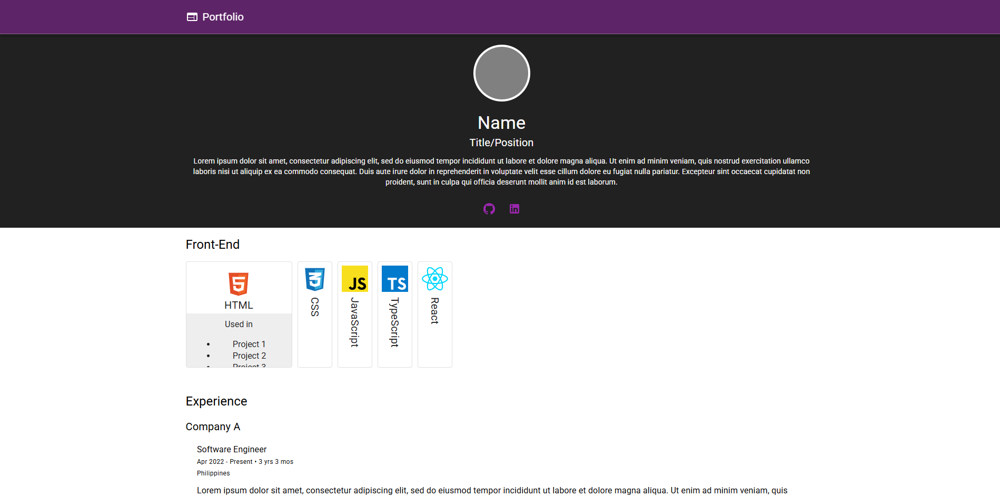
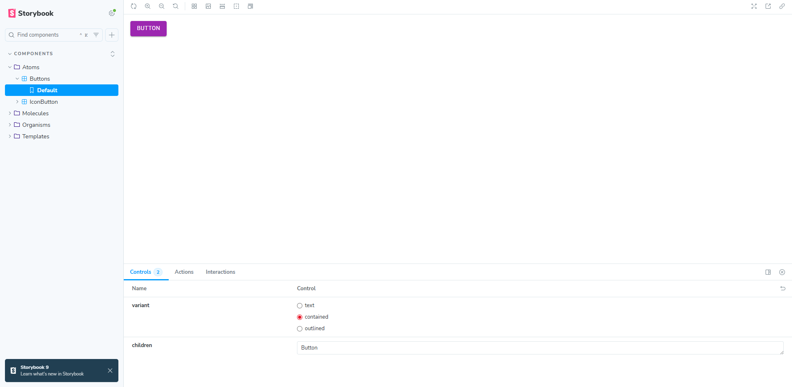

# Portfolio React App

Welcome to the souce code of my simple portfolio website!

<table align="center">
  <tr>
    <td align="center">
      <br>
      <sub><em>Figure 1: React App</em></sub>
    </td>
    <td align="center">
      <br>
      <sub><em>Figure 2: Storybook</em></sub>
    </td>
  </tr>
</table>

**Portfolio:** https://portfolio.lloydborres.com \
**Storybook:** https://portfolio-sb.lloydborres.com \
**Figma:** https://www.figma.com/design/RQCYf7U8FfqjJGFWUtd2IS/Portfolio?node-id=7603-7193&t=rfPgFeRNNeaUoJou-1

## Version Notes

- `releases/v2.0` and above uses Firebase Firestore to display data
- `releases/v1.2` and below uses `data.tsx` file to display data

## Tech Stack/Libraries

- [React + TypeScript + Vite](https://vite.dev/guide)
- [Firebase](https://firebase.google.com/)
- [Storybook](https://storybook.js.org)
- [Material UI](https://mui.com/material-ui)
- [MomentJS](https://momentjs.com)

## Setup

1. Clone the repository
2. Create an `.env` file based from [.env.example](.env.example) (optional)
3. Run `npm run dev` to start the dev server.
4. Run `npm run storybook` to start storybook.
5. Material themes can be modified in [themes.tsx](src/configs/themes.tsx) and primary/secondary colors can be modified in the `.env` file (optional).
6. Data are stored in [Firebase Firestore](#setup-firebase-firestore).
7. More [index.html](./index.html) customization can now be modified through `.env` file.

## Deployment

1. Setup a [Firebase Project](console.firebase.google.com).
2. Setup hosting in that project.
3. Add another site if you want to deploy storybook as well (optional).
4. Install Firebase CLI if you haven't yet.
   ```
   npm install -g firebase-tools
   ```
5. Login through Firebase CLI if you haven't yet.
   ```
   firebase login
   ```
6. Create a `.firebaserc` based from [.firebaserc.example](.firebaserc.example).
7. Update the names in `.firebaserc` to match your Project IDs created in Firebase.
   - `nickname-portfolio` should be replaced with the default id as you created the project.
   - `nickname-portfolio-storybook` should be replaced with the additional site you created within the project.
8. Run `npm run build` to build the React App (Portfolio).
9. Run `npm run build-storybook` to build the Storybook.
10. Run `npm run deploy-dev-portfolio` to deploy the React App to a dev channel for testing (optional).
11. Run `npm run deploy-dev-storybook` to deploy the Storybook to a dev channel for testing (optional).
12. `npm run deploy-all` will deploy both React App and Storybook to their respective site.

## Setup Firebase Firestore

1. Setup a [Firebase Project](console.firebase.google.com) if you haven't yet.
2. Create a Firestore database under 'All products'.
3. Get you Firebase config and update your `.env` file with their respective values.
4. In your Firestore rules, at least allow read for everyone `allow read: if true;`.
5. Create a new collection named `users` and auto-fill ID with the following fields and type.
   ```
   {
      name: string;
      title: string;
      description: string;
      profilePicSrc?: string;
      email?: string;
      github?: string;
      linkedin?: string;
   }
   ```
6. Create a sub-collection named `skillSets` under `users` collection and auto-fill ID with the following fields and type. Add more documents if necessary.
   ```
   {
      title: string;
      skills: string[]; // Array of strings e.g. ['html', 'css']
   }
   ```
7. Create a sub-collection named `experiences` under `users` collection and auto-fill ID with the following fields and type. Add more documents if necessary.
   ```
   {
      companyName: string;
      positions: {
        title: string;
        description: string;
        location: string;
        startDate: Timestamp;
        endDate?: Timestamp;
      }[]; // Array of positions
   }
   ```
8. Create a sub-collection named `projects` under `users` collection and auto-fill ID with the following fields and type. Add more documents if necessary.
   ```
   {
      title: string;
      description: string;
      coverImg?: string;
      actions: {
        label: string;
        href: string;
        isExternal: string;
      }[]; // Array of actions
   }
   ```
9. Updated data will now be fetched from the Firestore database without having to redeploy.
